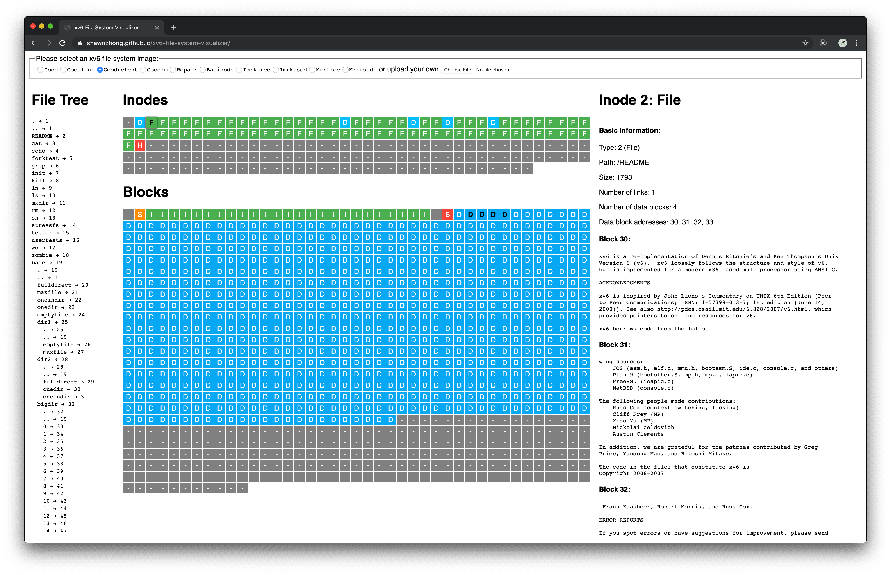

# xv6 File System Visualizer

[This](https://shawnzhong.github.io/xv6-file-system-visualizer/) is an online visualizer for xv6 file system image. The source code is published at [GitHub](https://github.com/ShawnZhong/xv6-file-system-visualizer)

## Screenshot

# 

## Screen Record

## Features

- See the overall layout of an xv6 filesystem image

- View the metadata storoed in inodes

- Trace the relationship between files/directories, inodes, and blocks

- Check the file/directory path for inodes

- Basic inconsistency checking: 
  
  - Invalid inode type.
  
  - Inode marked use but not found in a directory.

  - Inode referred to in directory but marked free.
  
  - Block used by inode but marked free in bitmap.
  
  - Bitmap marks block in use but it is not in use.
